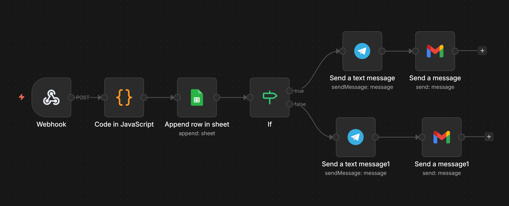

 🧠 CRM Lead Scoring System (n8n)

 📌 Description

This project is an intelligent CRM automation system built with n8n.
It captures incoming leads via webhook, automatically scores them based on business criteria, and triggers personalized actions.

 ⚙️ Technologies Used

* n8n (workflow automation)
* Webhook (lead input)
* JavaScript (lead scoring logic)
* Google Sheets
* Telegram Bot
* Gmail API

 🔥 Key Feature: Lead Scoring System

Leads are automatically evaluated using a scoring algorithm based on:

* Budget level
* Industry sector
* Contact information availability
* Message quality

 Scoring Logic

* HOT 🔥 → High-value leads (priority contact)
* WARM ⚡ → Medium potential leads
* COLD ❄️ → Low priority leads

 🔄 Workflow Steps

1. Webhook → receives lead data
2. JavaScript Code → calculates lead score
3. Append Row → stores data in Google Sheets
4. IF Node → determines lead category
5. Actions:

   * HOT leads → instant Telegram alert + priority email
   * COLD leads → standard follow-up notification

 📸 Workflow Screenshot

 🛠️ How to Use

1. Import `workflow.json` into n8n
2. Configure webhook endpoint
3. Customize scoring logic if needed
4. Connect Google Sheets
5. Set up Telegram bot
6. Configure Gmail account
7. Activate the workflow

 🎯 Use Case

Automate lead qualification and prioritization in CRM systems to improve sales efficiency.

 👨‍💻 Author

Ziad El Yazidi
